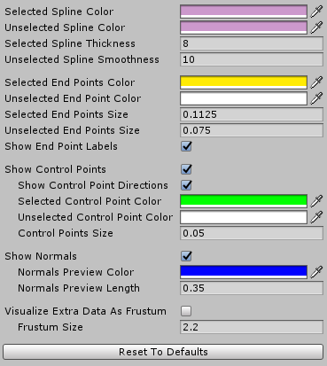
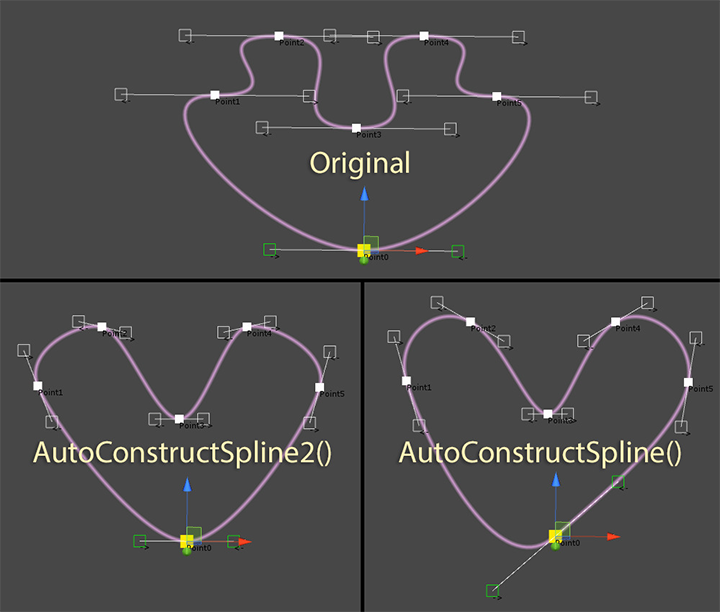
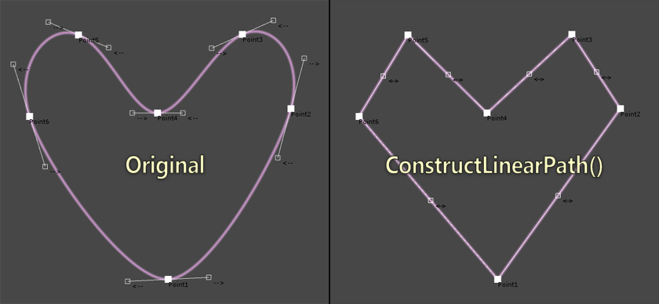
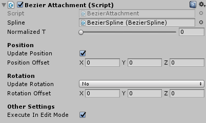
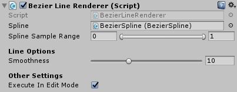
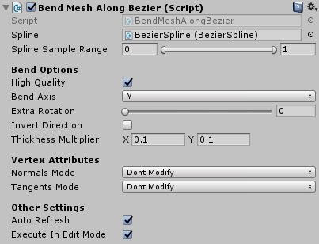

# Unity Bezier Solution


**Available on Asset Store:** https://assetstore.unity.com/packages/tools/level-design/bezier-solution-113074

**Forum Thread:** https://forum.unity.com/threads/bezier-solution-open-source.440742/

**Discord:** https://discord.gg/UJJt549AaV

**Video:** https://www.youtube.com/watch?v=OpniwcFwSY8

**[GitHub Sponsors ☕](https://github.com/sponsors/yasirkula)**

## ABOUT

This asset is a means to create bezier splines in editor and/or during runtime: splines can be created and edited visually in the editor, or by code during runtime. It is built upon *Catlike Coding*'s spline tutorial: https://catlikecoding.com/unity/tutorials/curves-and-splines/

## INSTALLATION

There are 5 ways to install this plugin:

- import [BezierSolution.unitypackage](https://github.com/yasirkula/UnityBezierSolution/releases) via *Assets-Import Package*
- clone/[download](https://github.com/yasirkula/UnityBezierSolution/archive/master.zip) this repository and move the *Plugins* folder to your Unity project's *Assets* folder
- import it from [Asset Store](https://assetstore.unity.com/packages/tools/level-design/bezier-solution-113074)
- *(via Package Manager)* add the following line to *Packages/manifest.json*:
  - `"com.yasirkula.beziersolution": "https://github.com/yasirkula/UnityBezierSolution.git",`
- *(via [OpenUPM](https://openupm.com))* after installing [openupm-cli](https://github.com/openupm/openupm-cli), run the following command:
  - `openupm add com.yasirkula.beziersolution`

## CREATING & EDITING A NEW SPLINE IN EDITOR

To create a new spline in the editor, click **GameObject - Bezier Spline**.

Now you can select the end points of the spline in the Scene view and translate/rotate/scale or delete/duplicate them as you wish (each end point has 2 control points, which can also be translated):


The user interface for the spline editor should be pretty self-explanatory with most variables having explanatory tooltips.


When **Quick Edit Mode** is enabled, new points can quickly be added/inserted to the spline and the existing points can be dragged around/snapped to the scene geometry.

To reverse the order of the end points in a spline, you can right click the BezierSpline component and click the *Invert Spline* button.

You can tweak the Scene view gizmos via *Project Settings/yasirkula/Bezier Solution* page (on older versions, this menu is located at *Preferences* window).



## CREATING & EDITING A NEW SPLINE BY CODE

- **Create a new bezier spline**

Simply create a new GameObject, attach a BezierSpline component to it (BezierSpline uses `BezierSolution` namespace) and initialize the spline with a minimum of two end points:

```csharp
BezierSpline spline = new GameObject().AddComponent<BezierSpline>();
spline.Initialize( 2 );
```

- **Populate the spline**

`BezierPoint InsertNewPointAt( int index )`: adds a new end point to the spline and returns it

`BezierPoint DuplicatePointAt( int index )`: duplicates an existing end point and returns it

`void RemovePointAt( int index )`: removes an end point from the spline

`void SwapPointsAt( int index1, int index2 )`: swaps indices of two end points

`void ChangePointIndex( int previousIndex, int newIndex )`: changes an end point's index

- **Shape the spline**

You can change the position, rotation, scale and normal values of the end points, as well as the positions of their control points to reshape the spline.

End points have the following properties to store their transformational data: `position`, `localPosition`, `rotation`, `localRotation`, `eulerAngles`, `localEulerAngles`, `localScale`, `normal`, `autoCalculatedNormalAngleOffset` and `intermediateNormals`.

Positions of control points can be tweaked using the following properties in BezierPoint: `precedingControlPointPosition`, `precedingControlPointLocalPosition`, `followingControlPointPosition` and `followingControlPointLocalPosition`. The local positions are relative to their corresponding end points.

End points also have read-only `spline`, `index`, `previousPoint` and `nextPoint` properties.

```csharp
// Set first end point's (world) position to 2,3,5
spline[0].position = new Vector3( 2, 3, 5 );

// Set second end point's local position to 7,11,13
spline[1].localPosition = new Vector3( 7, 11, 13 );

// Set handle mode of first end point to Free to independently adjust each control point
spline[0].handleMode = BezierPoint.HandleMode.Free;

// Reposition the control points of the first end point
spline[0].precedingControlPointLocalPosition = new Vector3( 0, 0, 1 );
spline[0].followingControlPointPosition = spline[1].position;
```

- **Auto construct the spline**

If you don't want to position all the control points manually, but rather generate a nice-looking "continuous" spline that goes through the end points you have created, you can call either **AutoConstructSpline()** or **AutoConstructSpline2()**. These methods are implementations of some algorithms found on the internet (and credited in the source code). If you want these functions to be called automatically when spline's end points are modified, simply change the spline's **autoConstructMode** property.



- **Convert spline to a linear path**

If you want to create a linear path between the end points of the spline, you can call the **ConstructLinearPath()** function. Or, if you want this function to be called automatically when spline's end points are modified, simply set the spline's **autoConstructMode** property to **SplineAutoConstructMode.Linear**.



- **Auto calculate the normals**

If you want to calculate the spline's normal vectors automatically, you can call the **AutoCalculateNormals( float normalAngle = 0f, int smoothness = 10, bool calculateIntermediateNormals = false )** function (or, to call this function automatically when spline's end points are modified, simply change the spline's **autoCalculateNormals**, **autoCalculatedNormalsAngle** and **m_autoCalculatedIntermediateNormalsCount** properties). All resulting normal vectors will be rotated around their Z axis by "normalAngle" degrees. Additionally, each end point's normal vector will be rotated by that end point's "autoCalculatedNormalAngleOffset" degrees. "smoothness" determines how many intermediate steps are taken between each consecutive end point to calculate those end points' normal vectors. More intermediate steps is better but also slower to calculate. When "calculateIntermediateNormals" is enabled, calculated intermediate normals (determined by "smoothness") are cached at each end point. This results in smoother linear interpolation for normals. Otherwise, the intermediate normals aren't stored anywhere and only the end points' normals are used to estimate normals along the spline.

If auto calculated normals don't look quite right despite modifying the "calculateIntermediateNormals" (*Auto Calculated Intermediate Normals* in the Inspector), "normalAngle" (*Auto Calculated Normals Angle* in the Inspector) and "autoCalculatedNormalAngleOffset" (*Normal Angle* in the Inspector) variables, you can either consider inserting new end points to the sections of the spline that normals don't behave correctly, or setting the normals manually.

- **Get notified when spline is modified**

You can register to the spline's **onSplineChanged** event to get notified when some of its properties have changed. This event has the following signature: `delegate void SplineChangeDelegate( BezierSpline spline, DirtyFlags dirtyFlags )`. **DirtyFlags** is an enum flag, meaning that it can have one or more of these values: **SplineShapeChanged**, **NormalsChanged** and/or **ExtraDataChanged**. *SplineShapeChanged* flag means that either the spline's Transform values have changed or some of its end points' Transform values have changed (changing control points may also trigger this flag). *NormalsChanged* flag means that normals of some of the end points have changed and *ExtraDataChanged* flag means that extraDatas of some of the end points have changed.

BezierSpline also has a **version** property which is automatically increased whenever the spline's properties change.

**NOTE:** onSplineChanged event is usually invoked in *LateUpdate*. Before it is invoked, *autoConstructMode* and *autoCalculateNormals* properties' values are checked and the relevant auto construction/calculation functions are executed if necessary.

## UTILITY FUNCTIONS

The framework comes with some utility functions. These functions are not necessarily perfect but most of the time, they get the job done. Though, if you want, you can use this framework to just create splines and then apply your own logic to them.

- `Vector3 GetPoint( float normalizedT )`

A spline is essentially a mathematical formula with a \[0,1\] clamped input (usually called *t*), which generates a point on the spline. As the name suggests, this function returns a point on the spline. As *t* goes from 0 to 1, the point moves from the first end point to the last end point (or goes back to first end point, if spline is looping).

- `Vector3 GetTangent( float normalizedT )`

Tangent is calculated using the first derivative of the spline formula and gives the direction of the movement at a given point on the spline. Can be used to determine which direction an object on the spline should look at at a given point.

- `Vector3 GetNormal( float normalizedT )`

Interpolates between the end points' normal vectors. If intermediate normals are calculated, they are interpolated to calculate the result. Otherwise, only the end points' normal vectors are interpolated and the resulting normal vectors may not be correct at some parts of the spline. Inserting new end point(s) to those sections of the spline could resolve this issue. By default, all normal vectors have value (0,1,0).

- `BezierPoint.ExtraData GetExtraData( float normalizedT )`

Interpolates between the extra data provided at each end point. This data has 4 float components and can implicitly be converted to Vector2, Vector3, Vector4, Quaternion, Rect, Vector2Int, Vector3Int and RectInt.

- `BezierPoint.ExtraData GetExtraData( float normalizedT, ExtraDataLerpFunction lerpFunction )`

Uses a custom function to interpolate between the end points' extra data. For example, BezierWalker components use this function to interpolate the extra data with Quaternion.Lerp.

- `float GetLengthApproximately( float startNormalizedT, float endNormalizedT, float accuracy = 50f )`

Calculates the approximate length of a segment of the spline. To calculate the length, the spline is divided into "accuracy" points and the Euclidean distances between these points are summed up.

**Food For Thought**: BezierSpline has a **length** property which is a shorthand for `GetLengthApproximately( 0f, 1f )`. Its value is cached and won't be recalculated unless the spline is modified.

- `Segment GetSegmentAt( float normalizedT )`

Returns the two end points that are closest to *normalizedT*. The *Segment* struct also holds a *localT* value in range \[0,1\], which can be used to interpolate between the properties of these two end points. You can also call the `GetPoint()`, `GetTangent()`, `GetNormal()` and `GetExtraData()` functions of this struct and the returned values will be calculated as if the spline consisted of only these two end points.

- `Vector3 FindNearestPointTo( Vector3 worldPos, out float normalizedT, float accuracy = 100f, int secondPassIterations = 7, float secondPassExtents = 0.025f )`

Finds the nearest point on the spline to any given point in 3D space. The normalizedT parameter is optional and it returns the parameter *t* corresponding to the resulting point. To find the nearest point, the spline is divided into "accuracy" points and the nearest point is selected. Then, a binary search is performed in "secondPassIterations" steps in range `[normalizedT-secondPassExtents, normalizedT+secondPassExtents]` to fine-tune the result.

- `Vector3 FindNearestPointToLine( Vector3 lineStart, Vector3 lineEnd, out Vector3 pointOnLine, out float normalizedT, float accuracy = 100f, int secondPassIterations = 7, float secondPassExtents = 0.025f )`

Finds the nearest point on the spline to the given line in 3D space. The pointOnLine and normalizedT parameters are optional.

- `Vector3 MoveAlongSpline( ref float normalizedT, float deltaMovement, int accuracy = 3 )`

Moves a point (normalizedT) on the spline deltaMovement units ahead and returns the resulting point. The normalizedT parameter is passed by reference to keep track of the new *t* parameter.

- `EvenlySpacedPointsHolder CalculateEvenlySpacedPoints( float resolution = 10f, float accuracy = 3f )`

Finds uniformly distributed points along the spline and returns a lookup table. The lookup table isn't refreshed automatically, so it may be invalidated when the spline is modified. This function's *resolution* parameter determines approximately how many points will be calculated per each segment of the spline and accuracy determines how accurate the uniform spacing will be. The default values should work well in most cases.

**Food For Thought**: BezierSpline has an **evenlySpacedPoints** property which is a shorthand for `CalculateEvenlySpacedPoints( evenlySpacedPointsResolution, evenlySpacedPointsAccuracy )`. Its value is cached and won't be recalculated unless the spline is modified.

*EvenlySpacedPointsHolder* class has *spline*, *splineLength* and *uniformNormalizedTs* variables. In addition, it has the following convenience functions:

**GetNormalizedTAtPercentage:** converts a percentage to normalizedT value, i.e. if you enter 0.5f as parameter, it will return the normalizedT value of the spline that corresponds to its actual middle point. 

**GetNormalizedTAtDistance:** finds the normalizedT value that is specified units away from the spline's starting point.

**GetPercentageAtNormalizedT:** inverse of *GetNormalizedTAtPercentage*.

- `PointCache GeneratePointCache( EvenlySpacedPointsHolder lookupTable, ExtraDataLerpFunction extraDataLerpFunction, PointCacheFlags cachedData = PointCacheFlags.All, int resolution = 100 )`

Returns a cache of data for uniformly distributed points along the spline. The cache isn't refreshed automatically, so it may be invalidated when the spline is modified. This function's *resolution* parameter determines how many uniformly distributed points the cache will have. To determine which data should be cached, *cachedData* parameter is used. *PointCacheFlags* is an enum flag, meaning that it can have one or more of these values: **Positions**, **Normals**, **Tangents**, **Bitangents** and/or **ExtraDatas**. *lookupTable* is an optional parameter and, by default, spline's *evenlySpacedPoints* is used. *extraDataLerpFunction* is also an optional parameter and is used only when PointCacheFlags.ExtraDatas is included in cachedData.

**Food For Thought**: BezierSpline has a **pointCache** property which is a shorthand for `GeneratePointCache( resolution: pointCacheResolution )`. Its value is cached and won't be recalculated unless the spline is modified.

*PointCache* class has *positions*, *normals*, *tangents*, *bitangents*, *extraDatas* and *loop* variables (loop determines whether or not the spline had its *loop* property set to true while calculating the cache). In addition, it has the following functions: *GetPoint*, *GetNormal*, *GetTangent*, *GetBitangent* and *GetExtraData* (if the required data for a function wasn't included in PointCacheFlags, then the function will throw an exception). If a spline is rarely modified at runtime, then point cache can be used to get points, tangents, normals, etc. along the spline in a cheaper and uniform way.

## OTHER COMPONENTS

The plugin comes with some additional components that may help you move objects or particles along splines. These components are located in the Utilities folder.

- **BezierWalkerWithSpeed**


Moves an object along a spline with constant speed. There are 3 travel modes: Once, Ping Pong and Loop. If *Look At* is Forward, the object will always face forwards (end points' normal vectors will be used as up vectors). If it is SplineExtraData, the extra data stored in the spline's end points is used to determine the rotation. You can modify this extra data from the points' Inspector. The smoothness of the rotation can be adjusted via *Rotation Lerp Modifier*. *Normalized T* determines the starting point. Each time the object completes a lap, its *On Path Completed ()* event is invoked. To see this component in action without entering Play mode, click the *Simulate In Editor* button.

- **BezierWalkerWithTime**


Travels a spline in *Travel Time* seconds. *Movement Lerp Modifier* parameter defines the smoothness applied to the position of the object. If *High Quality* is enabled, the spline will be traversed with constant speed but the calculations can be more expensive.

- **BezierWalkerLocomotion**


Allows you to move a number of objects together with this object on a spline. This component must be attached to an object with a BezierWalker component (tail objects don't need a BezierWalker, though). *Look At*, *Movement Lerp Modifier* and *Rotation Lerp Modifier* parameters affect the tail objects. If tail objects jitter too much, enabling *High Quality* may help greatly but the calculations can be more expensive.

- **ParticlesFollowBezier**


Moves particles of a Particle System in the direction of a spline. It is recommended to set the **Simulation Space** of the Particle System to **Local** for increased performance. This component affects particles in one of two ways:

**Strict:** particles will strictly follow the spline. They will always be aligned to the spline and will reach the end of the spline at the end of their lifetime. This mode performs slightly better than Relaxed mode

**Relaxed:** properties of the particle system like speed, Noise and Shape will affect the movement of the particles. Particles in this mode will usually look more interesting. If you want the particles to stick with the spline, though, set their speed to 0

Note that if the **Resimulate** tick of the Particle System is selected, particles may move in a chaotic way for a short time while changing the properties of the particle system from the Inspector.

- **BezierAttachment**



Snaps an object to the specified point of the spline. You can snap the object's position and/or rotation values, optionally with some offsets. Rotation can be snapped in one of two ways:

**Use Spline Normals:** spline's normal vectors will be used to determine the object's rotation

**Use End Point Rotations:** the Transform rotation values of the spline's end points will be used to determine the object's rotation

- **BezierLineRenderer**



Automatically positions a Line Renderer's points so that its shape matches the target spline's shape. It is possible to match the shape of only a portion of the spline by tweaking the *Spline Sample Range* property. If Line Renderer's **Use World Space** property is enabled, then its points will be placed at the spline's current position. Otherwise, the points will be placed relative to the Line Renderer's position and they will rotate/scale with the Line Renderer.

- **BendMeshAlongBezier**



Modifies a MeshFilter's mesh to bend it in the direction of a spline (make sure that the spline's normals are perpendicular to the spline; *Auto Calculate Normals* may help). If *High Quality* is enabled, evenly spaced bezier points will be used so that the mesh bends uniformly but the calculations will be more expensive. If *Auto Refresh* is enabled, the mesh will be refreshed automatically when the spline is modified (at runtime, this has the same effect with disabling the component but in edit mode, disabling the component will restore the original mesh instead). Mesh's normal and tangent vectors can optionally be recalculated in one of two ways:

**Modify Originals:** the original mesh's normal and tangent vectors will be rotated with the spline

**Recalculate From Scratch:** Unity's `RecalculateNormals` and/or `RecalculateTangents` functions will be invoked to recalculate these vectors from scratch

Note that this component doesn't add new vertices to the original mesh, so if the original mesh doesn't have enough vertices in its bend axis, then the bent mesh will have jagged edges on complex splines.
