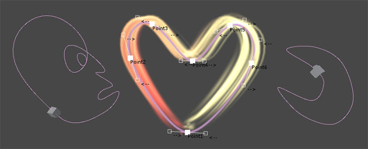
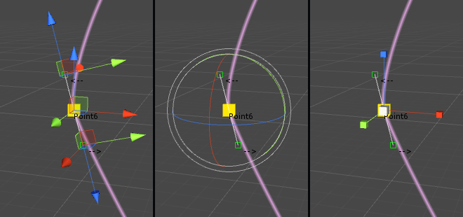
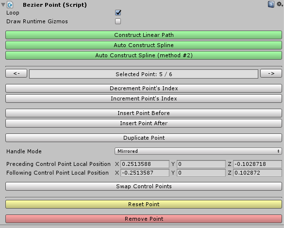
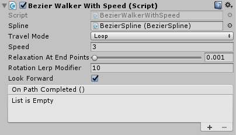
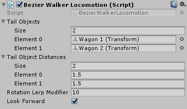
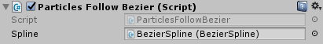

# Unity Bezier Solution



**Available on Asset Store:** https://www.assetstore.unity3d.com/en/#!/content/113074

**Forum Thread:** https://forum.unity.com/threads/bezier-solution-open-source.440742/

### ABOUT

This asset is a means to create bezier splines in editor and/or during runtime: splines can be created and edited visually in the editor, or by code during runtime.

### UPGRADING FROM PREVIOUS VERSIONS

If you are using a previous version of this plugin that was released before 01.20.2018, you should first export your splines in JSON format in order not to lose your current splines.

To export your splines, you should copy [Upgrade/BezierSplineExport.cs](Upgrade/BezierSplineExport.cs) to the Assets/Editor folder of your project (create it if not exists). Afterwards, select a spline in your scene, click the cog icon of Bezier Spline component in Inspector and select *Export*. Repeat the process for all your splines.

After exporting your splines, upgrade the plugin by importing Bezier.unitypackage to your project. It is recommended that you delete Assets/Plugins/BezierSolution folder first for a fresh upgrade. Finally, to bring your splines back to life, use the *Import* button in the Bezier Spline component's context menu.

### CREATING & EDITING A NEW SPLINE IN EDITOR

To create a new spline in the editor, follow "GameObject - Bezier Spline".

Now you can select the end points of the spline in the Scene view and translate/rotate/scale or delete/duplicate them as you wish (each end point has 2 control points, which can also be translated):



The user interface for the spline editor should be pretty self-explanatory. However, if I were to mention a couple of things:



**Loop**: connects the first end point and the last end point of the spline

**Draw Runtime Gizmos**: draws the spline during gameplay. Can be tweaked and customized using *DrawGizmos*/*HideGizmos* functions (see *UTILITY FUNCTIONS*)

**Handle Mode**: control points of end points are handled in one of 3 ways: Free mode allows moving control points independently, Mirrored mode places the control points opposite to each other and Aligned mode ensures that both control points are aligned on a line that passes through the end point (unlike Mirrored mode, their distance to end point may differ)

**Construct Linear Path**: constructs a completely linear path between the end points by using *Free* handle mode and adjusting the control points of end points (see *Convert spline to a linear path* section below)

**Auto Construct Spline**: auto adjusts the control points of end points to form a smooth spline that goes through the end points you set. There are 2 different implementations for it, with each giving a slightly different output (see *Auto construct the spline* section below)

### CREATING & EDITING A NEW SPLINE BY CODE

- **Create a new bezier spline**

Simply create a new GameObject, attach a BezierSpline component to it (BezierSpline uses *BezierSolution* namespace) and initialize the spline with a minimum of two end points:

```csharp
BezierSpline spline = new GameObject().AddComponent<BezierSpline>();
spline.Initialize( 2 );
```

- **Populate the spline**

`BezierPoint InsertNewPointAt( int index )`: adds a new end point to the spline and returns it

`BezierPoint DuplicatePointAt( int index )`: duplicates an existing end point and returns it

`void RemovePointAt( int index )`: removes an end point from the spline

`void SwapPointsAt( int index1, int index2 )`: swaps indices of two end points

`int IndexOf( BezierPoint point )`: returns the index of an end point

- **Shape the spline**

You can change the position, rotation and scale values of end points and the positions of their control points to reshape the spline.

End points have the following properties to store their transformational data: position, localPosition, rotation, localRotation, eulerAngles, localEulerAngles and localScale.

Positions of control points can be tweaked using the following properties in BezierPoint: precedingControlPointPosition, precedingControlPointLocalPosition, followingControlPointPosition and followingControlPointLocalPosition. The local positions are relative to their corresponding end points.

```csharp
// Set first end point's (world) position to 2,3,5
spline[0].position = new Vector3( 2, 3, 5 );

// Set second end point's local position to 7,11,13
spline[1].localPosition = new Vector3( 7, 11, 13 );

// Set handle mode of first end point to Free to independently adjust each control point
spline[0].handleMode = BezierPoint.HandleMode.Free;

// Reposition the control points of the first end point
spline[0].precedingControlPointLocalPosition = new Vector3( 0, 0, 1 );
spline[0].followingControlPointPosition = spline[1].position;
```

- **Auto construct the spline**

If you don't want to position all the control points manually, but rather generate a nice-looking "continuous" spline that goes through the end points you have created, you can call either **AutoConstructSpline()** or **AutoConstructSpline2()**. These methods are implementations of some algorithms found on the internet (and credited in the source code). There is a third algorithm (*AutoConstructSpline3()*) which is not implemented, but feel free to implement it yourself!


- **Convert spline to a linear path**

If you want to create a linear path between the end points of the spline, you can call the **ConstructLinearPath()** function.


### UTILITY FUNCTIONS

The framework comes with some utility functions. These functions are not necessarily perfect but most of the time, they get the job done. Though, if you want, you can use this framework to just create splines and then apply your own logic to them.

- `Vector3 GetPoint( float normalizedT )`

A spline is essentially a mathematical formula with a [0,1] clamped input (usually called *t*), which generates a point on the spline. As the name suggests, this function returns a point on the spline. As *t* goes from 0 to 1, the point moves from the first end point to the last end point (or goes back to first end point, if spline is looping).

- `Vector3 GetTangent( float normalizedT )`

Tangent is calculated using the first derivative of the spline formula and gives the direction of the movement at a given point on the spline. Can be used to determine which direction an object on the spline should look at at a given point.

- `float GetLengthApproximately( float startNormalizedT, float endNormalizedT, float accuracy = 50f )`

Calculates the approximate length of a segment of the spline. To calculate the length, the spline is divided into "accuracy" points and the Euclidean distances between these points are summed up.

**Food For Thought**: BezierSpline has a Length property, which is simply a shorthand for `GetLengthApproximately( 0f, 1f )`.

- `Vector3 FindNearestPointTo( Vector3 worldPos, out float normalizedT, float accuracy = 100f )`

Finds the nearest point on the spline to any given point in 3D space. The normalizedT parameter is optional and it returns the parameter *t* corresponding to the resulting point. To find the nearest point, the spline is divided into "accuracy" points and the nearest point is selected. Thus, the result will not be 100% accurate but will be good enough for casual use-cases.

- `Vector3 MoveAlongSpline( ref float normalizedT, float deltaMovement, int accuracy = 3 )`

Moves a point (normalizedT) on the spline deltaMovement units ahead and returns the resulting point. The normalizedT parameter is passed by reference to keep track of the new *t* parameter.

- `void DrawGizmos( Color color, int smoothness = 4 )`

Starts drawing the spline during gameplay using GL lines. As *smoothness* increases, drawn spline will become smoother.

- `void HideGizmos()`

Stops drawing the spline during gameplay.

### OTHER COMPONENTS

Framework comes with 3 additional components that may help you move objects or particles along splines. These components are located in the Utilities folder.

- **BezierWalkerWithSpeed**



Moves an object along a spline with constant speed. There are 3 travel modes: Once, Ping Pong and Loop. If Look Forward is selected, the object will always face forward and the smoothness of the rotation can be adjusted using the Rotation Lerp Modifier. Each time the object completes a lap, its On Path Completed () event is invoked.

- **BezierWalkerWithTime**


Travels a spline in Travel Time seconds. Movement Lerp Modifier parameter defines the smoothness applied to the position of the object.

- **BezierWalkerLocomotion**



Allows you to move a number of objects together with this object on a spline. This component must be attached to an object with a BezierWalker component (tail objects don't need a BezierWalker, though). Look Forward and Rotation Lerp Modifier parameters affect the tail objects. If you attach this component to a BezierWalkerWithTime object, it is recommended that you set its Movement Lerp Modifier to something big, like 1000.

- **ParticlesFollowBezier**



Moves particles of a Particle System in the direction of a spline. It is recommended to set the **Simulation Space** of the Particle System to **World** for increased performance. This component affects particles in one of two ways:

**Strict**: particles will strictly follow the spline. They will always be aligned to the spline and will reach the end of the spline at the end of their lifetime. This mode performs slightly better than Relaxed mode

**Relaxed**: properties of the particle system like speed, Noise and Shape will affect the movement of the particles. Particles in this mode will usually look more interesting. If you want the particles to stick with the spline, though, set their speed to 0

Note that if the **Resimulate** tick of the Particle System is selected, particles may move in a chaotic way for a short time while changing the properties of the particle system from the Inspector.
